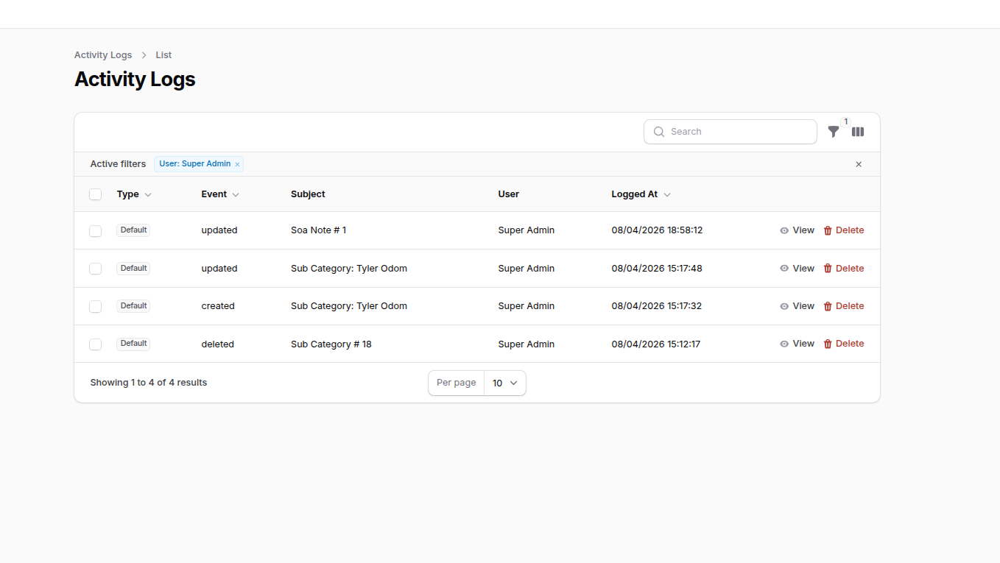
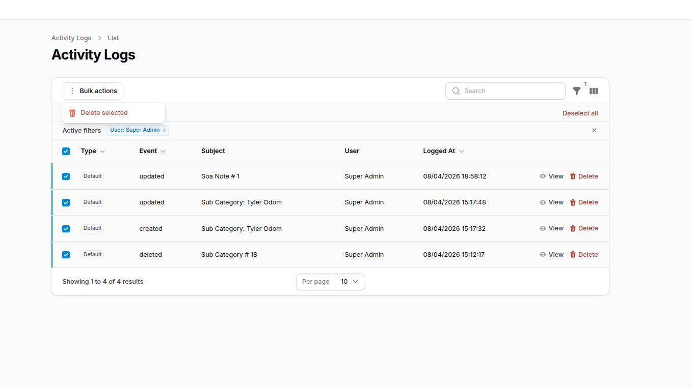
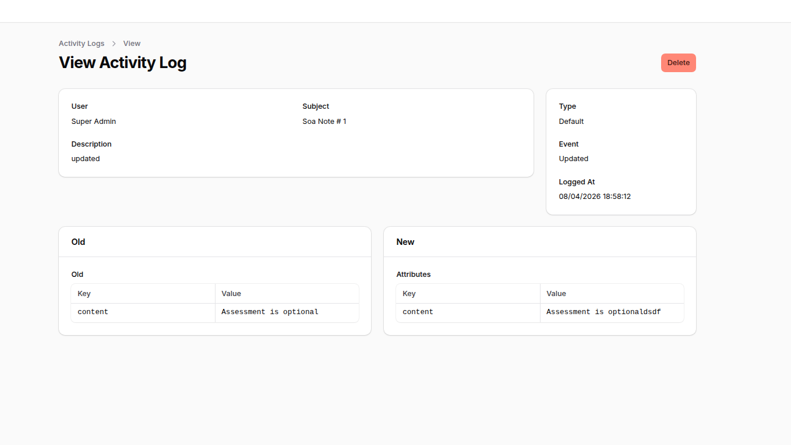

> [!NOTE]
> This is a fork of [Z3d0X/filament-logger](https://github.com/Z3d0X/filament-logger) with Filament 4 support.
> Now maintained by [keroles19](https://github.com/keroles19) with improvements and bug fixes.

# Activity logger for filament

[](https://packagist.org/packages/kerodev/filament-logger)
[](https://packagist.org/packages/kerodev/filament-logger)


Configurable activity logger for filament.
Powered by `spatie/laravel-activitylog`

## Features
You can choose what you want to log and how to log it.
- Log Filament Resource Events
- Log Login Event
- Log Notification Events
- Log Model Events
- Easily extendable to log custom events

Note: By default this package will log Filament Resource Events, Access(Login) Events, and Notification Events. If you want to log a model that is not a FilamentResource you will have to manually register in the config file.

## Installation

| Plugin Version | Filament Version |
|----------------|------------------|
| <= 0.5.x       | ^2.11            |
| 0.6.x - 0.8.x  | 3.x              |
| >= 1.0         | 4.x              |

This package uses [spatie/laravel-activitylog](https://spatie.be/docs/laravel-activitylog), instructions for its setup can be found [here](https://spatie.be/docs/laravel-activitylog/v4/installation-and-setup)

You can install the package via composer:

```bash
composer require kerodev/filament-logger
```
After that run the install command:

```bash
php artisan filament-logger:install
```
This will publish the config & migrations from `spatie/laravel-activitylog`

Register the plugin in your PanelProvider:
```php
use Keroles\FilamentLogger\FilamentLoggerPlugin;

public function panel(Panel $panel): Panel
{
    return $panel
        ->plugins([
            FilamentLoggerPlugin::make(),
        ]);
}
```

## Authorization
To enforce policies on `ActivityResource`, after generating a policy, you would need to register `Spatie\Activitylog\Models\Activity` to use that policy in the AuthServiceProvider.
```php
<?php
 
namespace App\Providers;
 
use App\Policies\ActivityPolicy;
use Illuminate\Foundation\Support\Providers\AuthServiceProvider as ServiceProvider;
use Spatie\Activitylog\Models\Activity;
 
class AuthServiceProvider extends ServiceProvider
{
    protected $policies = [
        // Update `Activity::class` with the one defined in `config/activitylog.php`
        Activity::class => ActivityPolicy::class,
    ];
    //...
}
```
> If you are using [Shield](https://filamentphp.com/plugins/shield) just register the ActivityPolicy generated by it

## Translations
Publish the translations using:

```bash
php artisan vendor:publish --tag="filament-logger-translations"
```

## Activity Model resolution
The main `Activity` class being used by the Filament Resource instance will be resolved by Spatie's service provider, which loads the model defined by the configuration key found at `activitylog.activity_model` in `config/activitylog.php`.

## Configurable Activity resource & table UI

Publish `config/filament-logger.php` and adjust:

- **`activity_resource`**: class used when registering the Filament plugin and list/view pages. Point this to your own `Resource` subclass if you need custom authorization, queries, or pages.
- **`table.global_search`**: enable the search field on the activity list (searches description, event, log name, subject type, and numeric subject id).
- **`table.global_search_properties_old_attributes`**: when `global_search` is on, also match Spatie’s **`properties.old`** and **`properties.attributes`** (the “new” values) using `LIKE` on the JSON text, so both **attribute names and values** are searchable (default `true`). Set to `false` on very large tables if needed.
- **`table.resolve_subject_label`**: when the subject model exists, show `ModelName: {name}` using common attributes (`name`, `title`, `email`, `slug`, or `getName()`).
- **`table.eager_load_relations`**: relations to eager load on the index query (default `subject`, `causer`).
- **`table.bulk_delete` / `table.row_delete`**: show bulk delete on the list and/or per-row delete + delete on the view page. **Off by default.**
- **`table.include_spatie_default_in_type_filter`**: include Spatie’s default `log_name` (`default`) in the type filter and badge colors (useful when using `LogsActivity` only).

## Avoiding duplicate rows (default + Resource + Model)

If you also use Spatie’s `LogsActivity` on models **and** leave `resources.enabled` and `models.enabled` on, the same save can create up to three activity rows (`default`, `Resource`, `Model`). Pick **one** CRUD pipeline per project, for example:

- Spatie-only: set `resources.enabled` and `models.enabled` to `false`, keep `LogsActivity` on your models; **or**
- Package observers only: disable `LogsActivity` where redundant and use Resource/Model loggers.

Keep `access` / `notifications` enabled if you still want login and notification logs.

## Deleting activity rows (`AuthorizesActivityDeletion`)

Bulk and row deletes (when enabled in `table.*_delete`) are gated by `Keroles\FilamentLogger\Contracts\AuthorizesActivityDeletion`. The package binds a default implementation that **denies all** deletes.

In your app’s `AppServiceProvider::register()` (or a service provider that loads early), bind your own rules, for example:

```php
use Keroles\FilamentLogger\Contracts\AuthorizesActivityDeletion;

$this->app->singleton(AuthorizesActivityDeletion::class, function () {
    return new class implements AuthorizesActivityDeletion {
        public function canDelete(?\Illuminate\Contracts\Auth\Authenticatable $user): bool
        {
            return $user !== null && $user->can('deleteAny', \Spatie\Activitylog\Models\Activity::class);
        }
    };
});
```

You can also register an `ActivityPolicy` (see **Authorization** above) and delegate to `Gate` as in the example.

## Screenshots

### Activity logs (list)

Table with type, event, subject (including resolved names), user, and timestamps. Sortable columns.



### Search, filters, and bulk actions

Global search, active filters (e.g. by user), row actions (view / delete), and bulk delete when enabled in config.



### View activity log (detail)

Single log view with metadata and **Old** vs **New** attribute comparison (Spatie `properties`).



## Changelog

Please see [CHANGELOG](CHANGELOG.md) for more information on what has changed recently.

## Contributing

Please see [CONTRIBUTING](https://github.com/spatie/.github/blob/main/CONTRIBUTING.md) for details.

## Security Vulnerabilities

Please review [our security policy](../../security/policy) on how to report security vulnerabilities.

## Credits

- [Ziyaan Hassan](https://github.com/Z3d0X) - Original package creator
- [Spatie Activitylog Contributors](https://github.com/spatie/laravel-activitylog#credits) 
- [All Contributors](../../contributors)

## License

The MIT License (MIT). Please see [License File](LICENSE.md) for more information.
